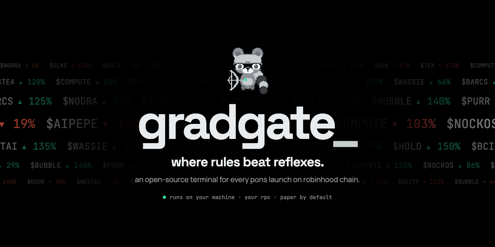
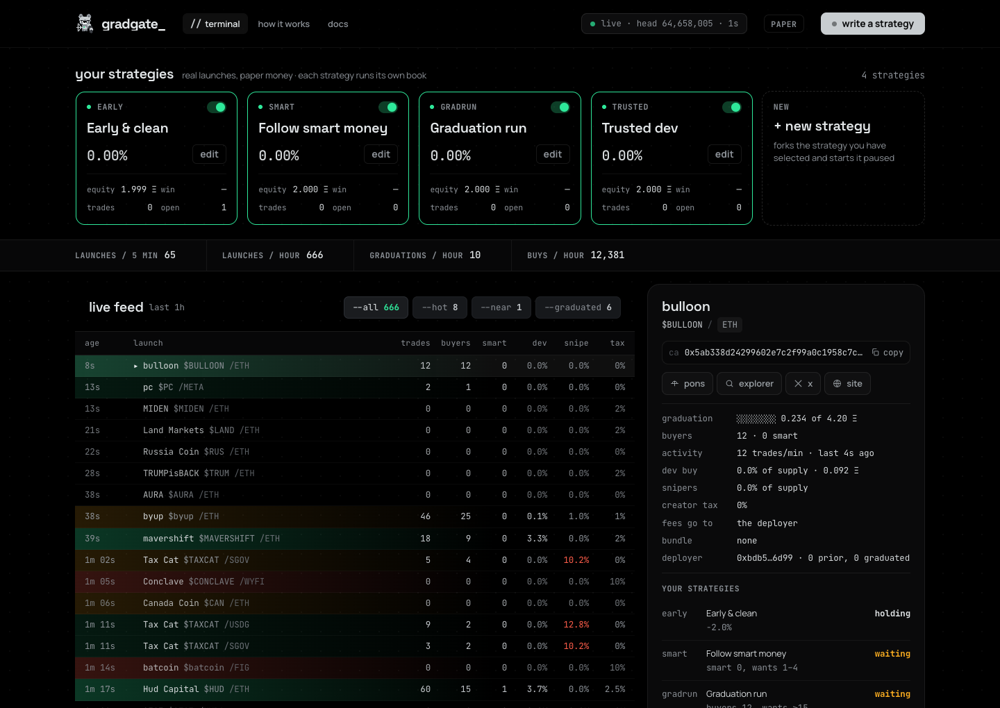
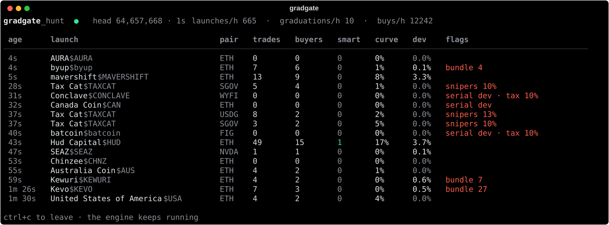
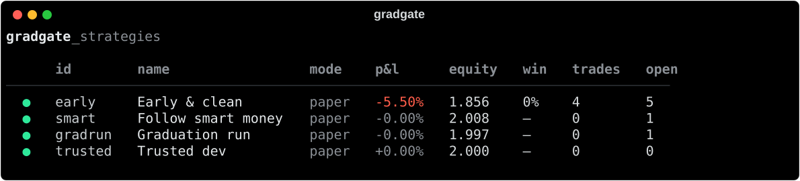
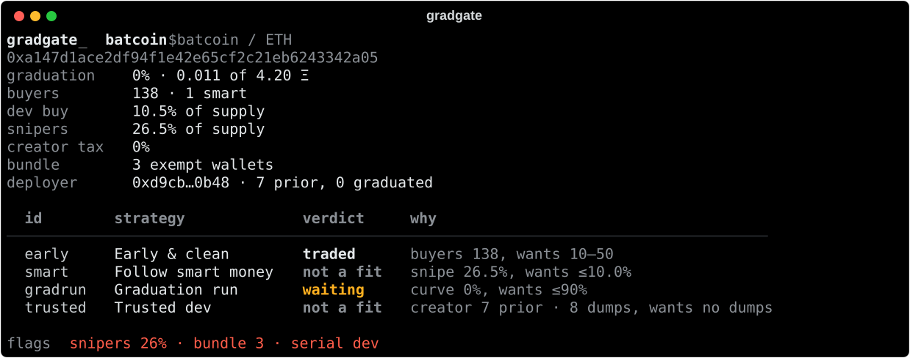
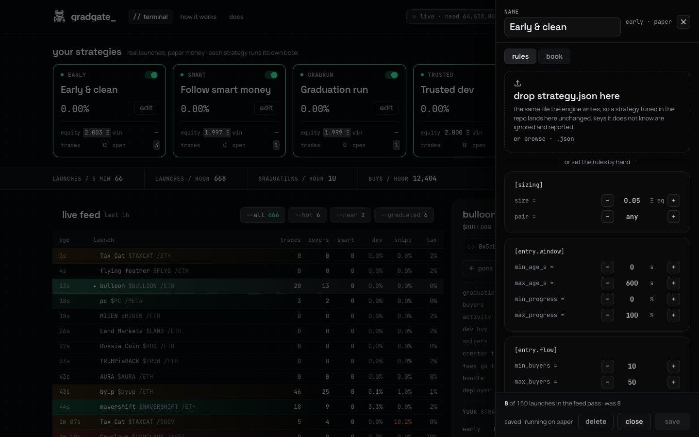
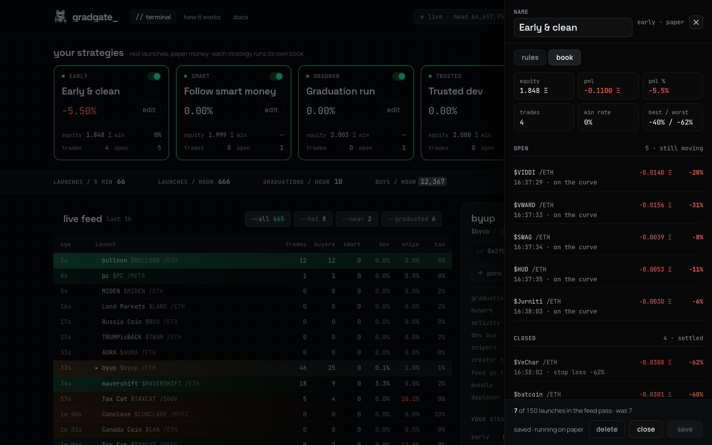
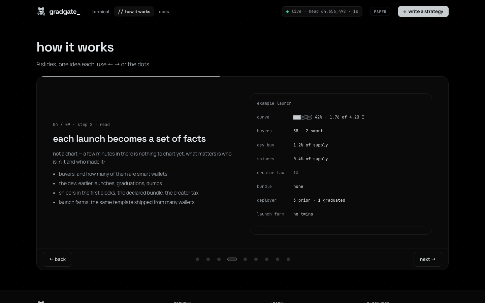

<p align="center">
  
</p>

<p align="center">
  <b>an open-source terminal for every pons launch on robinhood chain.</b><br>
  reads each launch in the block it lands · remembers 114k wallets and 200k devs · trades your rules, paper by default
</p>

<p align="center">
  
  
  
  
</p>

<p align="center">
  <a href="https://gradgate.xyz">gradgate.xyz</a> ·
  <a href="docs/README.md">docs</a> ·
  <a href="https://x.com/gradgatexyz">@gradgatexyz</a>
</p>

---

Pons puts hundreds of launches an hour on Robinhood Chain. About 2 in 100 reach graduation; the rest go quiet, most inside a minute — often after a bundle, a sniper or a serial dev got to the first buyers. Nobody can read that by hand. **gradgate** reads all of it and lets strategies you write act on what it sees.

<p align="center"></p>

## what it does

- **the feed** — every launch, every curve trade, every graduation, over a websocket. named within seconds, shaded by activity and red flags.
- **the coin card** — buyers and smart wallets, dev buy, snipers in the first blocks, the declared bundle, creator tax, where the fees go, the dev's record, launch-farm twins. and every strategy's verdict with the checks behind it.
- **a memory** — 114,051 wallets and 198,528 devs with a record, built from 14 days of pons and kept growing while it runs. a *smart wallet* bought 3+ launches and at least a quarter of them graduated.
- **strategies as rules** — entry rules say which launches qualify, exit rules say when to leave. json you can read, fork and diff. an editor shows how many launches in the feed would pass while you type.
- **paper first** — a signal fills one second later at the curve's real price and fee, never inside the opening tax, and after graduation it is priced and sold in the launch's uniswap v4 pool. every strategy runs its own book.
- **live when you say so** — the same engine trades real money with your key and your limits: strategies you switch to live, and manual buys and sells that are planned and simulated before anything is signed. nothing leaves your machine except calls to the chain.

## quick start

**double-click** — `Gradgate.command` on macOS, `Gradgate.cmd` on windows. the first run installs everything (about a minute), every run after that opens the terminal. you need [python 3.11+](https://www.python.org/downloads/).

**or in a terminal** (macOS · linux)

```bash
git clone https://github.com/gradgatexyz/gradgate gradgate && cd gradgate
./install.sh
.venv/bin/gradgate start          # http://127.0.0.1:8765
```

**windows** — powershell, same thing with windows paths:

```powershell
git clone https://github.com/gradgatexyz/gradgate gradgate; cd gradgate
.\install.ps1
.venv\Scripts\gradgate start     # http://127.0.0.1:8765
```

**or with docker** (any OS, postgres included, restarts take seconds)

```bash
cp .env.example .env
docker compose up
```

the first start reads the last hour of launches and trades off the chain — two to four minutes, the header says `warming up` until then. `gradgate doctor` checks everything before you start.

## the command line

`gradgate start` runs the engine and the terminal. from a second terminal, the other commands read the running engine.

```text
gradgate start              the engine and the terminal on 127.0.0.1:8765
gradgate doctor             rpc, websocket, database, key and limits, checked
gradgate hunt               the live feed in your terminal
gradgate strategies         every strategy with its book
gradgate book early         one book: cash, open positions, closed trades
gradgate on early           switch a strategy on   (off pauses it)
gradgate token 0x…          a coin card with every strategy's verdict
gradgate kill               stop new live entries now   (unkill lifts it)
gradgate wallet             your address, ETH, limits and the kill switch
gradgate buy 0x… 0.005      plan a buy on the curve — add --send to trade
gradgate sell 0x…           plan a sell on the curve or in the pool — add --send to trade
```

every command is in [docs/COMMANDS.md](docs/COMMANDS.md).

<p align="center"></p>

<table>
  <tr>
    <td width="50%"></td>
    <td width="50%"></td>
  </tr>
</table>

## strategies

four house strategies ship as starting points to fork — not advice, and no expected returns.

| id | name | waits for | leaves |
|---|---|---|---|
| `early` | early & clean | up to 10 min old · 10–50 buyers · snipers ≤5% · no bundle · tax ≤3% · farm twins ≤1 | stop −40% · 30 min · at graduation |
| `smart` | follow smart money | up to 15 min · 1–4 smart wallets in · snipers ≤10% | half at +100% · stop −35% · 30 min |
| `gradrun` | graduation run | curve 60–90% and still rising · 15+ buyers | stop −20% · 60 min · at graduation |
| `trusted` | trusted dev | dev graduated before and never dumped · socials · tax ≤2% | +150% · stop −30% · holds through graduation |

<table>
  <tr>
    <td width="50%"></td>
    <td width="50%"></td>
  </tr>
</table>

a strategy is one json object in `engine/strategies.json` — the editor writes it, and you can too:

```json
{
  "id": "early", "name": "Early & clean", "enabled": true, "mode": "paper",
  "size": 0.05, "cash": 2.0, "quote": "any",
  "entry": { "max_age_s": 600, "min_buyers": 10, "max_buyers": 50, "max_snipe_pct": 5.0,
             "max_creator_tax_bps": 300, "max_exempt": 0, "max_farm_twins": 1 },
  "exit":  { "sl_pct": 40, "timeout_s": 1800, "on_graduation": true }
}
```

every rule has an off position, so a strategy only lists what it checks. all of them — window, flow, wallets, the dev's record, the launch record, exits — are in [docs/STRATEGIES.md](docs/STRATEGIES.md) with examples.

<p align="center"></p>

## live trading

> **real money.** use a fresh wallet that holds only what you can lose. rules that did well on paper can lose live. nothing here is advice.

1. put the key in `.env`: `RH_PRIVATE_KEY=0x…` — `gradgate doctor` shows the address and its balance.
2. set limits: `LIVE_MAX_SIZE` (largest entry, default 0.01), `LIVE_MAX_OPEN` (positions at once, default 3), `LIVE_DAILY_STOP` (losses that stop new entries for the day, default 0.05). `engine/risk.json` overrides them without a restart.
3. the editor only makes paper strategies: set `"mode": "live"` and a `size` within the limit in `engine/strategies.json`, then restart.
4. stop new entries any moment: `gradgate kill`. open positions still exit by their rules.

or trade by hand: `gradgate buy <token> <eth>` and `gradgate sell <token>` print a plan — the curve's quote, the minimum you accept, the opening tax, an `eth_call` of the exact transaction — and trade only with `--send` and a typed `yes`. the full guide and a checklist before real money: [docs/LIVE.md](docs/LIVE.md).

live orders read the curve's opening tax for your address and wait until it is under 3%, spend the launch's own pair (ETH, USDG, a stock token), sell on the curve while it trades and in the uniswap v4 pool after graduation, book nothing until the transaction is mined, and send a reverted exit back out with wider slippage. open live positions survive a restart.

## settings

`.env` in the repository root — the defaults in `.env.example` are free public endpoints. they rate-limit when the chain is busy; before trading live, put your own provider in `RH_RPC` ([alchemy](https://www.alchemy.com) has a free tier).

| key | what it does |
|---|---|
| `RH_RPC` | calls: names, launch records, curve and pool quotes |
| `RH_RPC_LOGS` | event logs when the engine catches up |
| `RH_WS` | the live feed; without it the engine polls every few seconds |
| `DATABASE_URL` | optional postgres: keeps 24 hours, restarts in seconds |
| `PAPER_LATENCY_S` | delay between a signal and its fill (default 1) |
| `RH_PRIVATE_KEY` | live trading only — leave it out and nothing trades for real |
| `LIVE_MAX_SIZE` · `LIVE_MAX_OPEN` · `LIVE_DAILY_STOP` | live limits |

## how it's built

```text
engine/     python · fastapi. indexer.py reads the chain (websocket + rpc), strategies.py decides and keeps the books,
            exec_pons.py and pons_pool.py sign and send (live only), store.py is the optional postgres layer.
            smart_wallets.json.gz and creators.json.gz are the memory it starts with.
ui/         react · vite. the terminal; ui/dist is prebuilt and served by the engine, node is only needed to change it.
gradgate/   the command line.
tests/      pytest: the opening tax, the live gates, the local-only api, manual trades, the docs, the curve.
docs/       strategies · live trading · commands · architecture
```

more in [docs/ARCHITECTURE.md](docs/ARCHITECTURE.md).

## safety

- **your key never leaves your machine.** it lives in `.env`; the engine reads it to know its own address and to sign orders for strategies you switched to live (`exec_pons.py`).
- **loopback only.** the engine listens on `127.0.0.1` and accepts changes — strategies, the kill switch — only from the machine it runs on. do not expose port 8765.
- **paper by default.** no key, no live order. a key alone is not enough either: a strategy has to be switched to `"mode": "live"` by hand.
- **no telemetry.** the only network traffic is to the rpc endpoints you configure and the ipfs gateways for launch images.

found a problem? see [SECURITY.md](SECURITY.md). want to help? see [CONTRIBUTING.md](CONTRIBUTING.md).

## faq

**does it front-run?** no. robinhood chain has no public mempool — the sequencer publishes finished blocks — so there is nothing to front-run and priority fees change nothing. gradgate enters by rules after it sees a launch, never inside the 99% opening tax.

**why do paper results differ from live ones?** paper fills at the curve's price one second after a signal; a live order competes with everyone else in that second. treat paper as a filter for bad rules, not a promise of good ones.

**do I need a database?** no. without postgres every start warms up for a few minutes; with it the engine keeps the last 24 hours and restarts in seconds.

---

<p align="center"><sub>MIT licensed. nothing here is advice — a verdict is a read, not a promise; results depend on your rules and the market.</sub></p>
